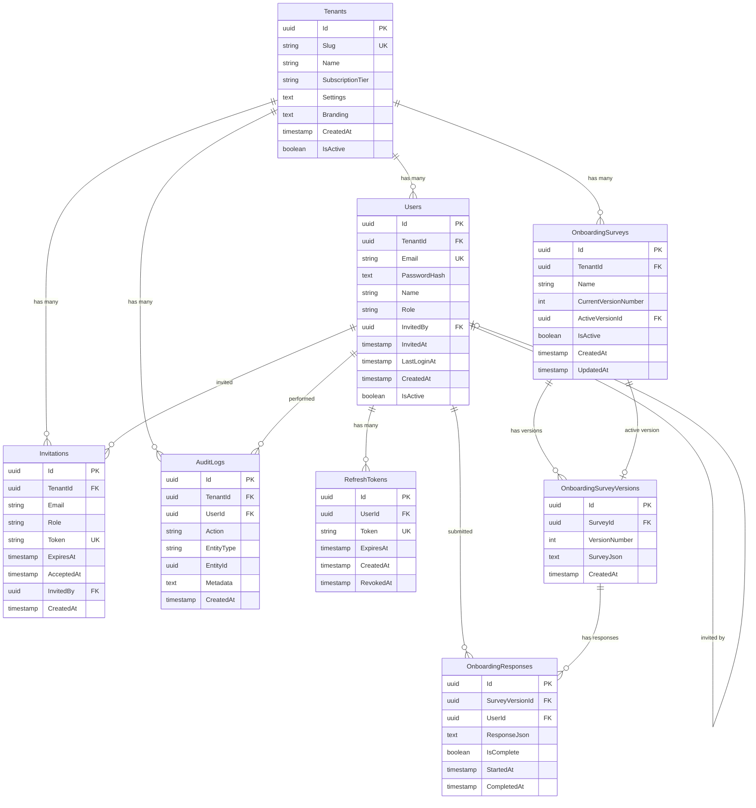
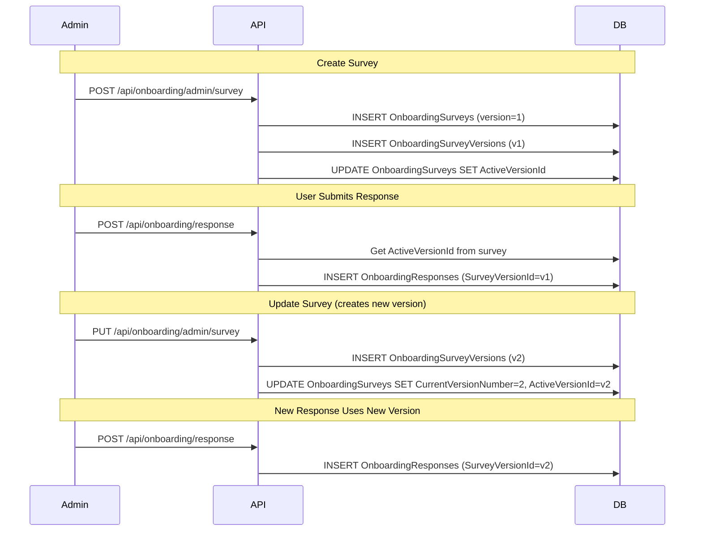

# Database Schema Documentation

## Entity Relationship Diagram



## Tables

### Tenants
The root entity for multi-tenancy. All other entities belong to a tenant.

| Column | Type | Nullable | Description |
|--------|------|----------|-------------|
| Id | uuid | NO | Primary key |
| Slug | varchar | NO | Unique URL-friendly identifier (e.g., "acme") |
| Name | varchar | NO | Display name |
| SubscriptionTier | varchar | NO | Subscription level (starter, professional, enterprise) |
| Settings | text | YES | JSON settings (notifications, timezone, language) |
| Branding | text | YES | JSON branding config (colors, logo) |
| CreatedAt | timestamp | NO | Creation timestamp |
| IsActive | boolean | NO | Whether tenant is active |

### Users
User accounts belonging to a tenant.

| Column | Type | Nullable | Description |
|--------|------|----------|-------------|
| Id | uuid | NO | Primary key |
| TenantId | uuid | NO | FK to Tenants |
| Email | varchar | NO | Unique within tenant |
| PasswordHash | text | NO | BCrypt hashed password |
| Name | varchar | NO | Display name |
| Role | varchar | NO | User role (Viewer, Member, Admin) |
| InvitedBy | uuid | YES | FK to Users (self-referential) |
| InvitedAt | timestamp | YES | When user was invited |
| LastLoginAt | timestamp | YES | Last login timestamp |
| CreatedAt | timestamp | NO | Creation timestamp |
| IsActive | boolean | NO | Whether user is active |

### Invitations
Pending user invitations.

| Column | Type | Nullable | Description |
|--------|------|----------|-------------|
| Id | uuid | NO | Primary key |
| TenantId | uuid | NO | FK to Tenants |
| Email | varchar | NO | Invited email address |
| Role | varchar | NO | Role to assign on acceptance |
| Token | varchar | NO | Unique invitation token |
| ExpiresAt | timestamp | NO | Expiration timestamp |
| AcceptedAt | timestamp | YES | When invitation was accepted |
| InvitedBy | uuid | NO | FK to Users |
| CreatedAt | timestamp | NO | Creation timestamp |

### RefreshTokens
JWT refresh tokens for authentication.

| Column | Type | Nullable | Description |
|--------|------|----------|-------------|
| Id | uuid | NO | Primary key |
| UserId | uuid | NO | FK to Users |
| Token | varchar | NO | Unique refresh token |
| ExpiresAt | timestamp | NO | Expiration timestamp |
| CreatedAt | timestamp | NO | Creation timestamp |
| RevokedAt | timestamp | YES | When token was revoked |

### AuditLogs
Activity audit trail.

| Column | Type | Nullable | Description |
|--------|------|----------|-------------|
| Id | uuid | NO | Primary key |
| TenantId | uuid | NO | FK to Tenants |
| UserId | uuid | YES | FK to Users (nullable for system actions) |
| Action | varchar | NO | Action performed |
| EntityType | varchar | NO | Type of entity affected |
| EntityId | uuid | YES | ID of entity affected |
| Metadata | text | YES | JSON additional data |
| CreatedAt | timestamp | NO | When action occurred |

### OnboardingSurveys
Survey/form definitions per tenant. Each tenant has one survey with multiple versions.

| Column | Type | Nullable | Description |
|--------|------|----------|-------------|
| Id | uuid | NO | Primary key |
| TenantId | uuid | NO | FK to Tenants |
| Name | varchar | NO | Survey display name |
| CurrentVersionNumber | int | NO | Latest version number |
| ActiveVersionId | uuid | YES | FK to OnboardingSurveyVersions (currently active) |
| IsActive | boolean | NO | Whether survey is enabled |
| CreatedAt | timestamp | NO | Creation timestamp |
| UpdatedAt | timestamp | NO | Last update timestamp |

### OnboardingSurveyVersions
Versioned survey configurations. Preserves history when surveys are modified.

| Column | Type | Nullable | Description |
|--------|------|----------|-------------|
| Id | uuid | NO | Primary key |
| SurveyId | uuid | NO | FK to OnboardingSurveys |
| VersionNumber | int | NO | Version number (1, 2, 3...) |
| SurveyJson | text | NO | SurveyJS JSON configuration |
| CreatedAt | timestamp | NO | When version was created |

**Unique constraint:** (SurveyId, VersionNumber)

### OnboardingResponses
New starter form submissions. Links to specific survey version.

| Column | Type | Nullable | Description |
|--------|------|----------|-------------|
| Id | uuid | NO | Primary key |
| SurveyVersionId | uuid | NO | FK to OnboardingSurveyVersions |
| UserId | uuid | NO | FK to Users (who submitted) |
| ResponseJson | text | NO | JSON form responses |
| IsComplete | boolean | NO | Whether submission is complete |
| StartedAt | timestamp | NO | When submission started |
| CompletedAt | timestamp | YES | When submission completed |

## Foreign Key Relationships

| From Table | Column | To Table | Column | Description |
|------------|--------|----------|--------|-------------|
| Users | TenantId | Tenants | Id | User belongs to tenant |
| Users | InvitedBy | Users | Id | Self-referential: who invited this user |
| Invitations | TenantId | Tenants | Id | Invitation belongs to tenant |
| Invitations | InvitedBy | Users | Id | Who created the invitation |
| RefreshTokens | UserId | Users | Id | Token belongs to user |
| AuditLogs | TenantId | Tenants | Id | Log belongs to tenant |
| AuditLogs | UserId | Users | Id | Who performed the action |
| OnboardingSurveys | TenantId | Tenants | Id | Survey belongs to tenant |
| OnboardingSurveys | ActiveVersionId | OnboardingSurveyVersions | Id | Currently active version |
| OnboardingSurveyVersions | SurveyId | OnboardingSurveys | Id | Version belongs to survey |
| OnboardingResponses | SurveyVersionId | OnboardingSurveyVersions | Id | Response submitted against specific version |
| OnboardingResponses | UserId | Users | Id | Who submitted the response |

## Multi-Tenancy

All data is isolated by tenant using:
1. **TenantId foreign key** on most tables
2. **Global query filters** in EF Core that automatically filter by current tenant

Query filters are defined in `AppDbContext.cs`:
```csharp
modelBuilder.Entity<User>().HasQueryFilter(u => u.TenantId == _tenantContext.TenantId);
modelBuilder.Entity<OnboardingSurvey>().HasQueryFilter(s => s.TenantId == _tenantContext.TenantId);
modelBuilder.Entity<OnboardingResponse>().HasQueryFilter(r => r.SurveyVersion.Survey.TenantId == _tenantContext.TenantId);
```

## Survey Versioning Flow


